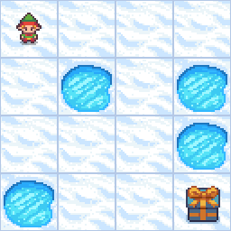

## Frozen Lake Environment

Frozen Lake is a reinforcement learning environment from the Toy Text collection in the Gym library. The goal is to navigate a grid representing a frozen lake from the starting point to a goal point, avoiding holes. Movement across the lake is complicated by the ice's slippery nature, which can cause the player to slide unintentionally.

### Action Space

The action space is discrete, allowing the following movements based on the action number:

- 0: Move left
- 1: Move down
- 2: Move right
- 3: Move up

### Observation Space

The observation is an integer representing the agent's linear position on the grid, calculated as:
For a 4x4 grid, the maximum observation value is 15 (bottom-right corner).

### Optimal Policy

The optimal policy has been calculated to reach the goal with a success rate of 74% and an average undiscounted return of 0.7400. Here is the policy for the 4x4 environment:

| 00      < | 01      ^ | 02      ^ | 03      ^ |
| 04      < |           | 06      < |           |
| 08      ^ | 09      v | 10      < |           |
|           | 13      > | 14      v |           |

### State-Value Function

The state-value function under the optimal policy is as follows:

| 00  0.542 | 01 0.4988 | 02 0.4707 | 03 0.4569 |
| 04 0.5585 |           | 06 0.3583 |           |
| 08 0.5918 | 09 0.6431 | 10 0.6152 |           |
|           | 13 0.7417 | 14 0.8628 |           |

